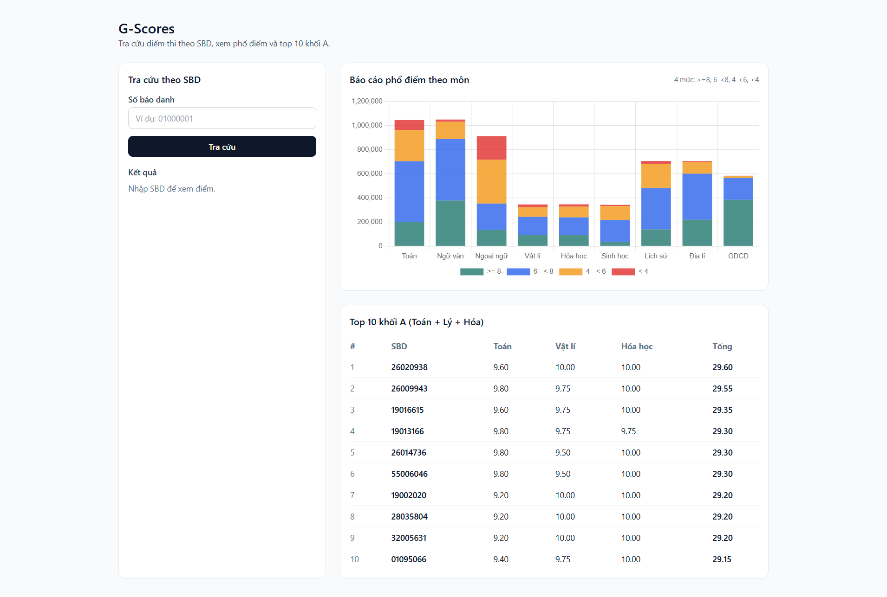

# G-Scores — THPT 2024 Score Lookup & Analytics

G-Scores is a Laravel application focused on real-world backend concerns:

- Importing a large CSV dataset (~1M rows) into PostgreSQL using streaming I/O
- Single-page score lookup by exam id (SBD) with an AJAX JSON endpoint
- Score distribution analytics (4 score ranges per subject) computed in SQL
- Top 10 students for Group A (Math + Physics + Chemistry)

## Live demo

https://g-scores-rwtd.onrender.com/

## Table of contents

- Features
- Endpoints
- Tech stack
- UI
- Project structure
- Data model (high-level)
- Quickstart
- Deployment (Render)
- CSV import
- API contract (AJAX lookup)
- Code quality
- Troubleshooting

## Features

- Streaming CSV import with chunked `upsert`
- Score lookup by SBD (8 digits) + robust validation
- AJAX lookup (`/lookup.json`) for the single-page UI
- Top 10 Group A computed directly in SQL
- Score distribution computed via SQL aggregation (no full-table reads into PHP)

## Endpoints

- `GET /` — Single-page UI (Lookup + Chart + Top 10)
- `POST /lookup` — Form submit (redirects back to `/` with `?sbd=`)
- `POST /lookup.json` — JSON lookup endpoint (used by the UI)

## Tech stack

- **Backend**: Laravel 12, PHP 8.2
- **Database**: PostgreSQL
- **ORM**: Eloquent
- **UI**: Blade + TailwindCSS (CDN)
- **Charts**: Chart.js (CDN)

## UI



## Project structure

Laravel source lives under `server/`.

- **Import command**: `server/app/Console/Commands/ImportScores.php`
- **Model**: `server/app/Models/Score.php`
- **Subject registry (OOP)**: `server/app/Subjects/*`
- **Services**: `server/app/Services/*`
- **Controllers**: `server/app/Http/Controllers/ScoreController.php`
- **View**: `server/resources/views/pages/home.blade.php`

## Data model (high-level)

- `scores.sbd` is a string primary key (8 chars) to preserve leading zeros.
- Score columns are nullable decimals; invalid/out-of-range values are stored as `NULL` during import.
- `ma_ngoai_ngu` is nullable and shown in lookup results.

## Quickstart

### Prerequisites

- PHP 8.2+
- Composer
- PostgreSQL

Notes:

- The UI uses TailwindCSS/Chart.js via CDN, so Node.js is not required.
- The default Laravel skeleton scripts in `server/composer.json` may mention `npm`; you can ignore them if you are not using Vite.

### Setup

```bash
cd server
composer install
```

Create `.env` and generate the app key:

Windows (PowerShell):

```bash
copy .env.example .env
php artisan key:generate
```

macOS/Linux:

```bash
cp .env.example .env
php artisan key:generate
```

Configure PostgreSQL in `server/.env`:

```env
DB_CONNECTION=pgsql
DB_HOST=127.0.0.1
DB_PORT=5432
DB_DATABASE=g_scores
DB_USERNAME=postgres
DB_PASSWORD=your_password
```

Run migrations:

```bash
php artisan migrate
```

Start the dev server:

```bash
php artisan serve
```

Open: `http://127.0.0.1:8000/`

## Deployment (Render)

This repository includes a Docker-based deployment setup for Render.

### Required environment variables

- `APP_ENV=production`
- `APP_DEBUG=false`
- `APP_URL=https://<your-service>.onrender.com`
- `APP_KEY=base64:...`
- `DB_CONNECTION=pgsql`
- `DB_URL=postgresql://...` (use Render's **Internal Database URL**)
- `LOG_CHANNEL=stderr`
- `LOG_LEVEL=info`

Recommended for the free tier:

- `SESSION_DRIVER=file`
- `CACHE_STORE=file`
- `QUEUE_CONNECTION=sync`

### First-time setup

The PostgreSQL database must be populated with the dataset before score lookup can return results.

On Render (free tier), interactive shell access may not be available. This repository supports importing the CSV at boot via environment variables (see **CSV import**).

Until the dataset is fully imported, the UI will display an “import in progress” state and the AJAX API (`POST /lookup.json`) will return `503` to prevent serving partial/incomplete data.

## CSV import

The dataset is intentionally not stored in this repository (it is large). Publish the CSV as a public artifact (e.g. GitHub Release) and import it into PostgreSQL.

- **Example dataset URL** (GitHub Release):
  `https://github.com/Tungggggggggggggg/g-scores/releases/download/dataset-2024/diem_thi_thpt_2024.csv`
- **Default dataset path**:
  `storage/app/dataset/diem_thi_thpt_2024.csv`

### Import command

The importer streams the CSV and uses chunked `upsert` into the `scores` table. It is designed to be safe to re-run.

```bash
php artisan scores:import
```

Common flags:

```bash
php artisan scores:import --path="storage/app/dataset/diem_thi_thpt_2024.csv"
php artisan scores:import --chunk=5000
php artisan scores:import --skip-if-complete
```

The `--skip-if-complete` flag skips the import only if the dataset has already been marked as `completed` in the `dataset_imports` table.

#### Import lifecycle (no partial imports)

To avoid the “partially imported but skipped on next boot” problem, the application tracks import state in `dataset_imports`:

- `running` — an import is currently in progress
- `completed` — the dataset is fully imported (only then can subsequent imports be skipped)
- `failed` — the last import attempt failed (if auto-import is enabled, the system will try again on the next boot)

The importer also uses a PostgreSQL advisory lock to ensure only one import process runs at a time.

### Local import (development)

1. Download the CSV:

```bash
mkdir -p storage/app/dataset
curl -L "<CSV_URL>" -o storage/app/dataset/diem_thi_thpt_2024.csv
```

2. Run migrations and import:

```bash
php artisan migrate
php artisan scores:import --path="storage/app/dataset/diem_thi_thpt_2024.csv" --chunk=2000
```

### Auto-import on Render

When using the Docker startup script (`start.sh`), the service can download and import the dataset automatically at boot.

Set Render environment variables:

- `SCORES_AUTO_IMPORT=1`
- `SCORES_CSV_URL=<CSV_URL>`
- `SCORES_IMPORT_CHUNK=2000` (optional)

Optional (force a full re-import on next boot):

- `SCORES_FORCE_REIMPORT=1`

When `SCORES_FORCE_REIMPORT=1` is set, the boot script will run the importer without `--skip-if-complete`. You should typically unset it after the re-import completes.

During boot, the service downloads the CSV into `storage/app/dataset/` and runs the import command in the background. By default it uses `--skip-if-complete` to avoid re-importing on every redeploy.

To inspect the current import state:

```sql
select dataset, status, started_at, completed_at, last_error
from dataset_imports;
```

## API contract (AJAX lookup)

### `POST /lookup.json`

This endpoint is protected by Laravel CSRF middleware. When calling it from the browser UI, the CSRF token is included automatically.

Example request:

```http
POST /lookup.json
Content-Type: application/x-www-form-urlencoded

sbd=01000001&_token=CSRF_TOKEN
```

Success response:

```json
{
  "error": false,
  "message": "OK",
  "details": {
    "sbd": "01000001",
    "toan": 8.5,
    "ngu_van": 6.75,
    "ngoai_ngu": 7.2,
    "vat_li": 8.0,
    "hoa_hoc": 7.75,
    "sinh_hoc": null,
    "lich_su": null,
    "dia_li": null,
    "gdcd": null,
    "ma_ngoai_ngu": "N1"
  }
}
```

Validation error (422):

```json
{
  "error": true,
  "message": "Số báo danh không hợp lệ. Vui lòng nhập đúng 8 chữ số.",
  "details": null
}
```

Not found (404):

```json
{
  "error": true,
  "message": "Không tìm thấy thí sinh với SBD 01000001.",
  "details": null
}
```

## Code quality

Format/lint (Laravel Pint):

```bash
cd server
php artisan pint
```

Run tests:

```bash
cd server
php artisan test
```

## Troubleshooting

- Missing `APP_KEY`: run `php artisan key:generate`, then try `php artisan optimize:clear`.
- If chart/top10 looks stale after importing: try `php artisan cache:clear`.
- If import is slow: increase `--chunk` and verify PostgreSQL performance (I/O, indexes, local resources).

If the site shows “import in progress” for too long:

- Check `dataset_imports.last_error`.
- Check Render logs for `scores:import` output.
- To re-run a clean import, either set `SCORES_FORCE_REIMPORT=1` for one deploy or delete the completion marker row for the dataset in `dataset_imports`.

Example SQL to clear the marker (optional):

```sql
delete from dataset_imports where dataset = 'diem_thi_thpt_2024';
```
